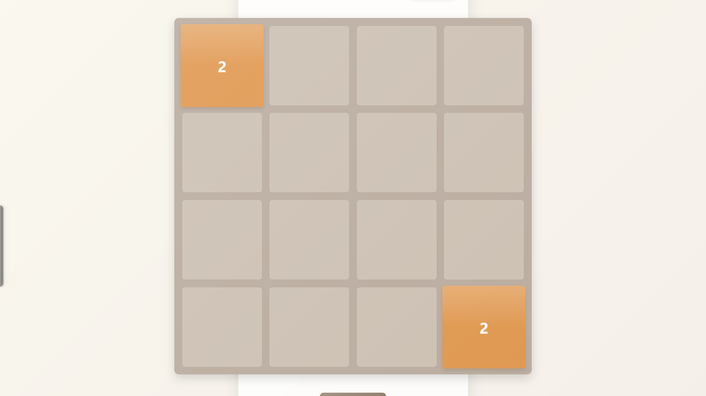

# 🎮 2048 Game

A beautiful, modern implementation of the classic 2048 puzzle game built with HTML, CSS, and JavaScript.

## 🔗 Quick Links

- [Play the Game Live](https://sainath666.github.io/2048_Game)
- [Connect with me on LinkedIn](https://www.linkedin.com/in/sainath666)

## 🎯 Game Overview

2048 is an addictive sliding puzzle game where you combine numbered tiles to reach the elusive 2048 tile!

## 🕹️ How to Play

- **Desktop**: Use your **arrow keys** (⬆️ ⬇️ ⬅️ ➡️) to slide all tiles in that direction
- **Mobile**: Simply **swipe** up, down, left, or right to move tiles
- When two tiles with the **same number** touch, they **merge into one** and their values add up
- After each move, a new tile (2 or 4) appears on the board
- Try to reach the **2048 tile** to win the game!

## ✨ Features

- ✅ Sleek, modern UI with smooth animations
- ✅ Score tracking to challenge yourself
- ✅ Mobile-friendly with touch swipe support
- ✅ Responsive design for all screen sizes
- ✅ "New Game" button to restart anytime
- ✅ Win and game-over detection

## 🛠️ Built With

- HTML5
- CSS3 with modern effects
- JavaScript (ES6+)

## 🚀 Getting Started

1. Clone this repository
2. Open `index.html` in your browser
3. Start playing and have fun!

---

  
Made with ❤️ by Sainathreddy

